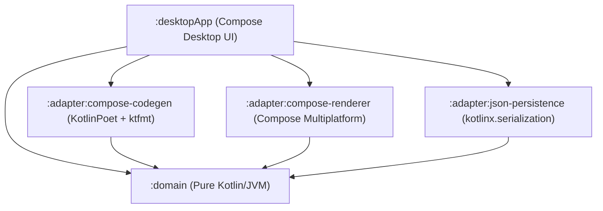

# M3Stage

**M3Stage** is a professional Material 3 visual studio and code generator for **Jetpack Compose** and **Compose Multiplatform**.

Design, assemble, and inspect Material 3 user interfaces across side-by-side device artboards on an infinite studio canvas, then export clean, production-ready Kotlin code formatted with Google's `ktfmt`.

---

## ✨ Features

### 🎨 Infinite Studio Artboard Canvas
- **Side-by-Side Multi-Screen Workbench**: View and edit multiple screens simultaneously in a horizontal artboard sequence.
- **Transformable Viewport**: Smooth zoom ($25\% - 250\%$), keyboard shortcuts (`+`, `-`, `0` for fit), and pan dragging via the Hand tool (`H`) or spacebar/drag.
- **Device Presets & Hardware Frames**: Switch presets (Pixel 8, iPhone 15, iPad, Desktop), toggle portrait/landscape orientations, and toggle realistic device bezel frames.
- **Floating Island Toolbars**: Quick-access capsule controls for viewport management, device configurations, and export actions.

### 🏛️ Canonical Material 3 Foundation
- **Canonical `Scaffold` Genesis**: Every screen is born with an M3 `Scaffold` root, child `TopAppBar`, and content container.
- **Smart Drag & Drop**: Dropping components onto a screen or `Scaffold` automatically routes them into the screen's main content column.
- **Dynamic Theming via MaterialKolor**: Generates the complete 36-role Material 3 color palette in real-time from any seed color, with instant Light/Dark mode toggling.

### 🧩 11-Component Full-Fidelity Metamodel
Zero registry drift across the metamodel, live renderer, and code generator:
| Category | Components | Supported Properties |
| :--- | :--- | :--- |
| **Layouts** | `Scaffold`, `Column`, `Row`, `Box` | Spacing, arrangements (`spacedBy`, `Center`, `SpaceBetween`, etc.), alignments, container color |
| **Navigation** | `TopAppBar` | Title, container color, title content color, action children |
| **Surfaces** | `Card` | Elevation (dp), container color, corner shape tokens |
| **Inputs** | `Button`, `TextField` | Enabled state, button colors, value, label, placeholder, single-line |
| **Display** | `Text`, `Icon`, `Image` | Content, typography tokens, color tokens, text overflow (Ellipsis), vector icons, tint, content description |

### ⚡ 100% WYSIWYG Code Export
- **Idiomatic Jetpack Compose Output**: Generated code uses canonical Compose APIs (`MaterialTheme.colorScheme`, `MaterialTheme.typography`, `MaterialTheme.shapes`, `Arrangement.spacedBy`, `ButtonDefaults.buttonColors`).
- **Google `ktfmt` Code Formatting**: All exported files are formatted with Google's official Kotlin code formatter.
- **Kotlin Identifier Sanitization**: Converts user screen names (e.g. `"Screen 1"`, `"my-profile"`, `"1Home"`) into valid PascalCase Kotlin files (`Screen1.kt`, `fun Screen1Screen()`) with collision deduplication.
- **Non-Blocking Architecture**: Code generation (KotlinPoet AST parsing and formatting) runs on `Dispatchers.Default` and file writing on `Dispatchers.IO`, keeping the desktop UI responsive at 60 FPS.

### 🛡️ Resilient Persistence & Data Loss Prevention
- **Corrupt File Quarantine**: If a project file fails JSON deserialization, M3Stage automatically preserves a timestamped quarantine backup (`project.json.corrupt_<timestamp>`) preventing accidental file wipeout.
- **Complete Undo/Redo**: Full history stack using the Command Pattern.
- **Pure-Function Invariants**: Round-trip invariance testing ensures that $\text{Project} \rightarrow \text{JSON} \rightarrow \text{Project}$ is 100% lossless.

---

## 🏗️ Hexagonal Architecture

M3Stage follows strict Hexagonal (Ports & Adapters) architecture with zero circular dependencies:



- **`:domain`**: Pure Kotlin/JVM with **zero UI or Compose dependencies**. Contains the core metamodel (`DesignNode`, `ComponentCatalog`, `PropertyKey`), tree mutation operations, and project invariants.
- **`:adapter:compose-codegen`**: Converts domain trees into KotlinPoet specifications with `ThemeCodeResolver`, `KotlinIdentifierSanitizer`, and `ktfmt` formatting.
- **`:adapter:compose-renderer`**: Renders live interactive previews in Compose Multiplatform using `ThemeResolver` and `SelectionOverlay`.
- **`:adapter:json-persistence`**: Handles project serialization using `kotlinx.serialization` with clean DTO $\leftrightarrow$ Domain mappers and quarantine recovery.
- **`:desktopApp`**: Compose Desktop application structured with **100% Dumb Atomic Design** (`ui.atom`, `ui.molecule`, `ui.organism`, `ui.template`) wired to an `EditorStore`.

---

## 🚀 Getting Started

### Prerequisites
- JDK 21+
- Gradle 8.x (bundled via `./gradlew`)

### Running the Desktop Studio
Run the application in standard or hot-reload mode:
```bash
./gradlew :desktopApp:run
```

### Running Tests
Execute the comprehensive unit test suite across all modules:
```bash
./gradlew test
```

### Complete Quality Check
Verify compilation, formatting, and tests across all 5 modules:
```bash
./gradlew check
```

---

## 📁 Project Structure

```
m3stage/
├── domain/                      # Pure Kotlin metamodel, tree queries, & mutations
├── adapter/
│   ├── compose-codegen/         # KotlinPoet code generation & ktfmt formatting
│   ├── compose-renderer/        # Compose Multiplatform live preview renderers
│   └── json-persistence/        # kotlinx.serialization DTOs & resilient file repo
└── desktopApp/                  # Compose Desktop studio application
    ├── src/main/kotlin/.../
    │   ├── state/               # EditorStore, delegates & command history
    │   └── ui/                  # Atomic Design (atom, molecule, organism, template)
```

---

## 📄 License

This project is licensed under the Apache 2.0 License.